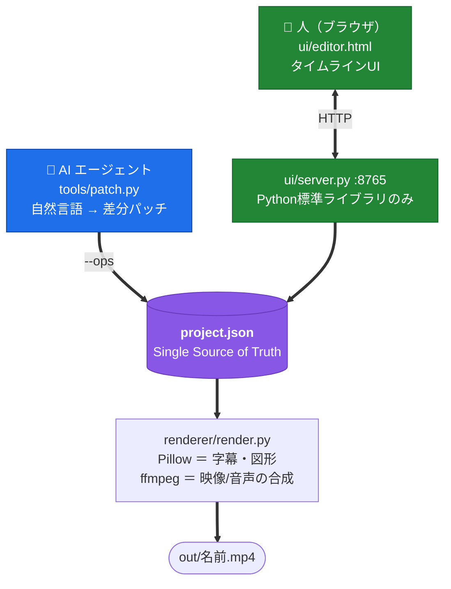

# GJ VIDEO EDITOR

**自然言語で作り、UIで仕上げる**動画編集ツール。
横型・縦型・正方形のどれでも作れます（書き出しサイズはいつでも変更できます）。
書き出した動画を一覧・再生する **GJ VIDEO VIEWER** も同梱しています。

> ⚠️ **開発中（v0.16.0）です。** 実務で毎日使っていますが、
> 仕様が変わることがあります。1.0 で安定版とする予定です。

📖 **[紹介ページ](https://gridjapan.github.io/gjVideoEditor/)** — 何ができるか、スクリーンショットとデモ動画つき

依存は **Python標準ライブラリ ＋ Pillow ＋ ffmpeg** だけ。フレームワークもクラウドもAPIキーも要りません。
編集UIは**素のHTML/JS 1枚**です。

```bash
git clone https://github.com/GridJapan/gjVideoEditor.git
cd video-editor
python3 tools/make_sample.py     # サンプルの素材を生成（初回のみ）
# Mac: start.command / Windows: launch.bat をダブルクリック
```

## 何が違うのか

多くの「AIで動画を作る」ツールは、成果物がコード（React/HTML）そのものなので**後からUIで触れません**。
このツールは AIもUIも**同じ `project.json` を書き換えるだけ**なので、両者が喧嘩しません。

- 自然言語で8割作る → UIで2割直す → また自然言語で追記する、を何度でも往復できる
- AIが書いた差分は保存前に検証される（重なり禁止・ソース長超過・素材の実在など）
- 人がUIで直した内容をAIが読み返して、次から同じ直しをしないようにできる



## 主な機能

- **タイムライン編集** — 映像/字幕/画像/音声のマルチトラック、ドラッグ&ドロップ、分割、undo/redo、吸着、ズーム
- **非破壊編集** — 長尺ソース1本を `in=`（ソース内オフセット）で参照する。切り出しmp4を作らないので端をいつでも伸ばせる
- **字幕** — 枠ドラッグ/リサイズ・揃え・フォント・360°回転・**縦書き**・部分強調・中央/端への吸着
- **ワイプ(PiP)** — プレビュー上でドラッグ移動・拡大縮小・角丸（1.0で正円）
- **書き出し** — MP4/WebM/GIF/MP3 × 画質 × 解像度
- **テンプレート量産** — 台本JSONを1枚書いて1コマンドで動画を1本
- **ナレーション生成** — edge-tts（無料・キー不要）/ ElevenLabs / macOS `say`

## 必要なもの

| | Mac | Windows |
|---|---|---|
| Python 3 | 標準で入っています | Microsoft Store から |
| ffmpeg | `brew install ffmpeg` | `winget install Gyan.FFmpeg` |
| Pillow | 初回起動時に自動で入ります | 同左 |
| edge-tts（ナレーションを使う場合） | `pip install -r requirements.txt` | 同左 |

## 使い方

```bash
python3 ui/server.py                          # 編集UI → http://localhost:8765/
python3 renderer/render.py projects/<名>      # 書き出し → projects/<名>/out/<title>.mp4

python3 tools/new_project.py <新名> --from sample-hello --dur 40   # 型を継承して新規作成
python3 tools/make_video.py 台本.json --voice --render             # テンプレートから1本
python3 tools/patch.py <名> --ops '[{"op":"set","track":"cap","clip":0,"set":{"y":0.7}}]'
```

## おすすめの使い方 — Claude アプリで「左に相棒・右に道具」

Claude デスクトップアプリから Claude Code を起動し、**左でチャット・右のプレビューペインでこのエディタを開く**構成が一番はかどります。

- **左（Claude Code）**: 「BGMもう少し小さく」「キャラを右下に」を自然言語で指示 → 差分が `project.json` に当たる
- **右（プレビューペイン）**: そのまま編集UIとして操作でき、🎞 ボタンで書き出し済み動画も確認できる
- ウィンドウを増やさず、1画面の中で「作って→触って→見る」が完結します

リポジトリには `CLAUDE.md` と `.claude/` （rules・skill）が入っているので、
Claude Code はこのツールの作法を最初から知った状態で作業します。

Claude を使わなくても、`start.command` / `launch.bat` から単体で普通に動きます。

## 素材の扱い

⚠️ **git には素材（画像・音声・映像）が入りません**（`.gitignore` で除外）。
唯一の例外が `projects/sample-hello/` で、これは `tools/make_sample.py` が生成したものです。

プロジェクトを誰かに渡すときは、UIの「📦 zip書き出し」で `.veproj.zip` を作ってください。
`project.json` だけを渡しても素材が無いので再生できません。

素材を追加するときは**出所とライセンスを必ず記録**してください（NOTICE を参照）。

## ライセンス

MIT License. 詳細は [LICENSE](LICENSE)、同梱素材の出所は [NOTICE](NOTICE) を参照してください。

作: 和泉良祐（GridJapan）
